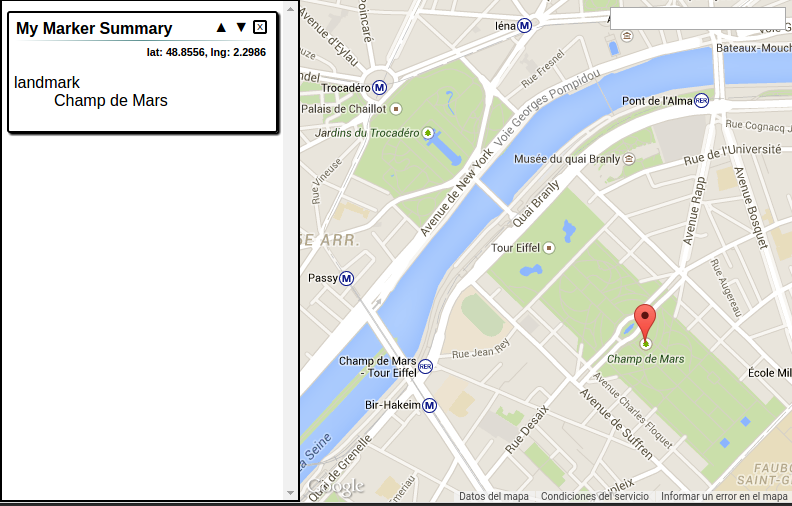

# Creating a Dashboard

Welcome to CityDashboard.js. On this brief introduction we will start setting up a map with a two markers.

## What is CityDashboard.js?

CityDashboard.js is a generic Web Dashboard for Urban Based Visualization Projects.

## Before we start

Before you can use CityDashboard.js, you need somewhere to display it.
Save the following HTML to a file on your computer, along with a copy of CityDashboard.min.js in the js/ directory, and open it on your browser.

``` html
<!DOCTYPE html>
<html>
  <head>
    <meta http-equiv="Content-Type" content="text/html;charset=UTF-8">
    <title>My first Dashboard</title>
    <style>
      html,
      body {
        margin: 0;
        width: 100%;
        height: 100%;
      }
      #dashboard {
        width: 100%;
        height: 100%;
      }
    </style>
    <!-- CityDashboard Styles -->
    <link rel="stylesheet" type="text/css" href="css/CityDashboard.css">

    <!-- jQuery -->
    <script src="js/jquery-1.11.1.min.js"></script>
    <!-- Google Maps import -->
    `<script src="https://maps.googleapis.com/maps/api/js?v=3.exp"></script>`

    <!-- CityDashboard import -->
    <script src="js/CityDashboard.min.js"></script>
  </head>

  <body>
    <div id="dashboard"></div>
  </body>

  <script>
    //our Javascript code goes here.
  </script>
</html>
```

That's all you need. All code below goes into the empty `<script>` tag.

## Creating the Dashboard

A City Dashboard consists on two things: A map and an information window.

CityDashboard.js has an easy support of GoogleMaps. You must include the Javascript API of GoogleMaps, and remember to add your developer key.

`<script src="https://maps.googleapis.com/maps/api/js?v=3.exp"></script>`

For more information about the GoogleMaps API and developers key, please visit [Google Developers](https://developers.google.com/maps/documentation/javascript/tutorial?).

First let's set up our Dashboard.

``` javascript
var myDashboard = new CityDashboard.Dashboard({
  'anchor': '#dashboard',
  'layout': 'left'
});
```

This will place our Dashbord on the container, and add a layout. The left layout will place our information window to the left of the map.

The next thing we will do is to set our map.

The map requires the center coordinates and the zoom level.

``` javascript
var map = new CityDashboard.GoogleMap({
  'lat': 48.8583,
  'lng': 2.2944,
  'zoom': 15
});
```

Now we have a map setted up, but we want this dashboard to give us some information.

We want to have a marker, when we click it the information window must show a summary of the marker.

Let's set up the information window with a `summary-viz`.

``` javascript
var infoWindow = new CityDashboard.InfoWindow([{
  'visualization': 'summary-viz',
  'data-source': '#myMarker',
  'id': '#summary',
  'title': 'My Marker Summary'
}]);
```
We just configurated the information window, adding a summary visualization with "My Marker Summary" as title, and we pointed out that the data comes from a map element called `'#myMarker'`.

## Adding a Marker

Every on-map visualization goes in a **Layer**. This Layers contain elements we call markers. We must set up this markers to do an action when we clicked them.

``` javascript
myDashboard.addLayer({
  'id': '#myMarker',
  'layer': 'marker-layer',
  'data-source': '#myMarker',
  'data': [{'lat': 48.8556,
          'lng': 2.2986,
          'landmark': 'Champ de Mars'
          }],
  'layer_attr': {
    'type': 'simple',
    'id': '#summary',
    'visualization': 'summary-viz',
    'title': 'My Summary from Marker.'
    }
});
```

First notice that our markers will have the `'#myMarker'` id, so now our information window will use the first marker it founds as its data-source.

We choose a marker-type layer.

The data-source of our markers are themselves, because we give them their data manually using the `'data'` property.

The `layer_attr` property sets the type of our marker and the behaviour of the marker when clicked.
In this case it is set to send it's data to a visualization of type `summary-viz` with an ID `#summary`.

Notice that the title is not the same as the one we setted on infoWindow. If you close the ***My Marker Summary*** visualization and click again on the marker, the visualization that appears has ***My Summary from Marker*** as its title.


> **About the data**
>
> The data property must be an Array of JSON objects, with properties `'lat'`, `'lng'` and `value`. All other properties will be shown at the visualization as a defintion list.
> The value property is used on charts.

If you refresh the page now you will see a marker over the Champ de Mars. The summary now contains the information added. The latitude and longitude of the element, and the values given.



Let's add a second marker so we can see the change happen.

Change the data parameter on the `'#myMarker'`, adding the data for the Eiffel Tower.

``` javascript
'data': [
  {
    'lat': 48.8556,
    'lng': 2.2986,
    'landmark': 'Champ de Mars'
  },
  {
    'lat': 48.8583,
    'lng': 2.2944,
    'landmark': 'Eiffel Tower',
    'fun-fact': 'Was built in 1889.'
  }],
```

You can see now two markers. Click on them and you'll see the summary change.

## Customize Markers

Let's customize it a bit. We don't want a red marker, but a blue circle.

Just change `layer_attr`.

```javascript
'layer_attr': {
  'type': 'circle',
  'radius': 30,
  'strokeColor': '#00f',
  'fillColor': '#00f',

  'id': '#summary',
  'visualization': 'summary-viz',
  'title': 'My Summary from Marker'
  }
```


## The result

Now you have completed your first CityDashboard.js visualization!

The full code is available below. Play around with it to get a better understanding of how it works.

``` html
<!DOCTYPE html>
<html>
  <head>
    <title>My first Dashboard</title>
    <style>
      html,
      body {
        margin: 0;
        width: 100%;
        height: 100%;
      }
      #dashboard {
        width: 100%;
        height: 100%;
      }
    </style>
    <!-- CityDashboard Styles -->
    <link rel="stylesheet" type="text/css" href="css/CityDashboard.css">

    <!-- jQuery -->
    <script src="js/jquery-1.11.1.min.js"></script>
    <!-- Google Maps import -->
    <script src="https://maps.googleapis.com/maps/api/js?v=3.exp"></script>

    <!-- CityDashboard import -->
    <script src="js/CityDashboard.min.js"></script>
  </head>

  <body>
    <div id="dashboard"></div>
  </body>

  <script>
    var myDashboard = new CityDashboard.Dashboard({
      'anchor': '#dashboard',
      'layout': 'left'
    });

    var map = new CityDashboard.GoogleMap({
      'lat': 48.8583,
      'lng': 2.2944,
      'zoom': 15
    });

    var infoWindow = new CityDashboard.InfoWindow([{
      'visualization': 'summary-viz',
      'data-source': '#myMarker',
      'id': '#summary',
      'title': 'My Marker Summary'
    }]);

    myDashboard.addLayer({
      'id': '#myMarker',
      'layer': 'marker-layer',
      'data-source': '#myMarker',
      'data': [{'lat': 48.8556,
              'lng': 2.2986,
              'landmark': 'Champ de Mars'
              },
              {'lat': 48.8583,
                'lng': 2.2944,
                'landmark': 'Eiffel Tower',
                'fun-fact': 'Was built in 1889.'
                }],
      'layer_attr': {
        'type': 'circle',
        'radius': 30,
        'strokeColor': '#00f',
        'fillColor': '#00f',

        'id': '#summary',
        'visualization': 'summary-viz',
        'title': 'My Summary from Marker'
        }
    });
  </script>
</html>
```